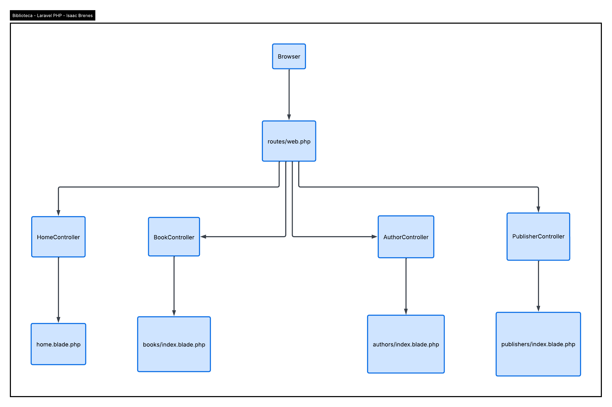

# Books App

**Autor:** Isaac Brenes  
**Diagrama:** `DIAGRAMA-CONTROLLERS` (ubicado en la carpeta raíz del proyecto)  
**Página web publicada:** [https://isaac-brenes.gamer.gd/](https://isaac-brenes.gamer.gd/)
**Instale dependencias:** composer install

## Descripción

Books App es una aplicación web para gestionar información sobre libros de computación, sus autores y editoriales. La aplicación permite:

- Listar libros con sus detalles: título, edición, número de páginas, idioma, categoría, dificultad, formato, calificación, autor y editorial.
- Consultar información detallada de cada autor, incluyendo su biografía, nacionalidad, campo de estudio, universidad y experiencia.
- Consultar información detallada de cada editorial, incluyendo país, año de fundación, especialización y logo.
- Navegar entre libros, autores y editoriales mediante enlaces directos.
- Interfaz responsiva y moderna utilizando Tailwind CSS.

---

## Estructura de Datos y Relaciones

La aplicación utiliza datos almacenados en un archivo PHP (`libraryData.php`) con la siguiente estructura:

### Author (Autor)
- **Atributos:** `id`, `name`, `nationality`, `birth_year`, `fields`, `biography`, `university`, `experience`, `awards`, `photo`.
- **Relación:** un autor puede tener muchos libros (1:N).

### Publisher (Editorial)
- **Atributos:** `id`, `name`, `country`, `founded`, `genere`, `description`, `headquarters`, `website`, `specialization`, `logo`.
- **Relación:** una editorial puede publicar muchos libros (1:N).

### Book (Libro)
- **Atributos:** `id`, `title`, `edition`, `copyright`, `language`, `pages`, `isbn`, `category`, `description`, `difficulty`, `format`, `rating`, `author_id`, `publisher_id`.
- **Relación:** cada libro pertenece a un autor y una editorial.

Esta relación se representa en un diagrama entidad-relación (ERD) como el que se muestra arriba.

---

## Tecnologías utilizadas

- **PHP 8+:** para manejar la lógica y los datos desde archivos PHP.
- **Laravel Blade:** motor de plantillas para renderizar vistas dinámicas.
- **Tailwind CSS:** para diseño moderno y responsivo.
- **HTML5 & CSS3:** estructura y estilo de las páginas.
- **JavaScript:** para interacción básica, como el menú móvil.

---

## Uso

1. Clonar el repositorio en tu máquina local.
2. Colocar los datos en `app/data/libraryData.php`.
3. Asegurarse de tener configurado un entorno de PHP y un servidor local (por ejemplo Laravel Valet, XAMPP o Laravel Sail).
4. Acceder a la aplicación mediante `http://localhost` (o la ruta definida).
5. Navegar entre libros, autores y editoriales.

---

## Imagen del Diagrama

La imagen del diagrama de relaciones debe guardarse en la carpeta raíz del proyecto o en `public/images/` como `diagrama.png`. Esta imagen ilustra cómo los libros se relacionan con autores y editoriales.

